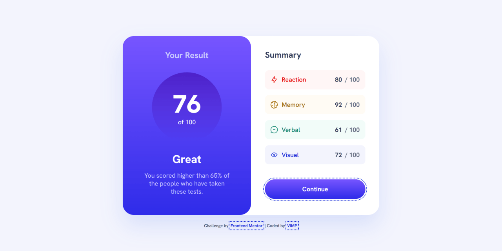
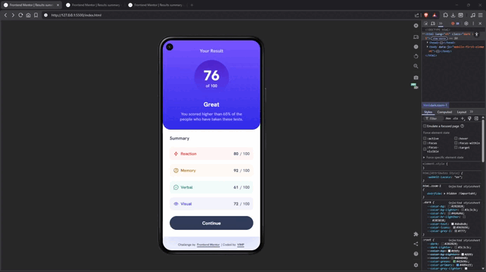

# 🚀 Results summary component - Frontend Mentor

This is a solution to the [Results summary component challenge on Frontend Mentor](https://www.frontendmentor.io/challenges/results-summary-component-CE_K6s0maV).  
A responsive UI component that displays user performance results, built with modern CSS architecture and dynamic data rendering using JavaScript.

---

## 🎬 Demo

---

## 🔗 Links

- 🌎 [Live site](https://vimpdev.github.io/fem-15-results-summary-component/)
<!-- - 📌 [Frontend Mentor Solution]() -->

---

## 🎯 The challenge

Users should be able to:

- View the optimal layout for the interface depending on their device's screen size
- See hover and focus states for all interactive elements on the page
- **Bonus**: Use the local JSON data to dynamically populate the content

---

## 📸 Screenshots

| 📱 Mobile | 📲 Tablet | 🖥️ Desktop |
| --- | --- | --- |
|  |  |  |

---

## 🛠️ Built with

- Semantic HTML5
- Modern CSS (with `@layer`, design tokens, native nesting)
- CSS Grid & Flexbox
- Mobile-first workflow
- JavaScript (ES Modules)
- Fetch API + `async/await`
- Accessibility best practices

---

## ⚡ Key Features

- Dynamic rendering of results from JSON data
- Fully responsive layout across devices
- Accessible UI with proper semantics and contrast
- Interactive states for buttons and links

---

## 🔍 Accessibility

- ✔️ Proper semantic HTML structure
- ✔️ Focus-visible states for keyboard navigation
- ✔️ Improved color contrast (validated with WebAIM)
- ✔️ Decorative images handled correctly (`alt=""`)

---

## 🧠 What I learned

- How to structure CSS using `@layer` for scalability
- Using design tokens to create a consistent design system
- Handling asynchronous data with `fetch` and `async/await`
- Avoiding common pitfalls with relative paths in production (GitHub Pages)
- Improving accessibility through contrast and semantic structure
- Creating smoother UI transitions using pseudo-elements

---

## 🤖 AI Collaboration

AI tools were used as a learning and support resource during development:

- Reviewing code and identifying improvements
- Debugging issues (e.g., fetch paths in production)
- Exploring better CSS architecture and naming conventions
- Refining commit messages following industry standards

All implementation decisions and code integration were handled manually.

---

## 👩‍💻 Author

- Frontend Mentor &ndash; [@vimpdev](https://www.frontendmentor.io/profile/vimpdev)

---